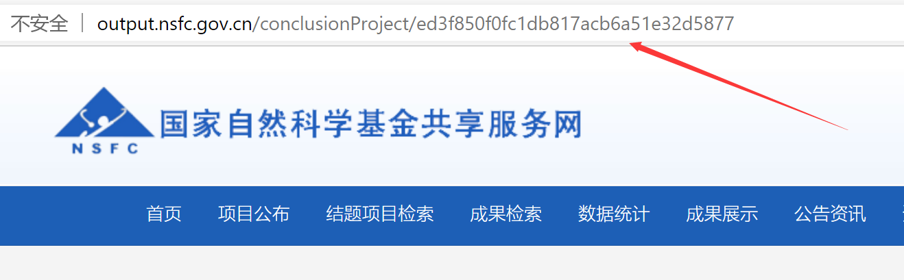
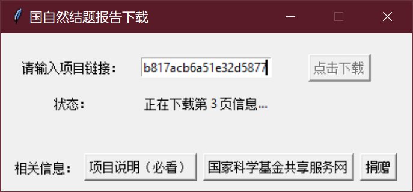

# NSFC_conclusion_downloader

帮助你从 [科学基金共享服务网（科技成果信息系统）](http://output.nsfc.gov.cn/) 下载 国自然结题报告，并生成PDF文件的工具。

## 声明

本项目仅为**科研学习使用**，未使用 国家自然科学基金 等标识进行任何性质的营利行为，
所有内容信息均来自 [科学基金共享服务网（科技成果信息系统）](http://output.nsfc.gov.cn/) 。

本项目使用MIT开源协议进行授权，对使用本项目造成相关损失的，不承担任何连带法律责任。

## 使用说明

> **重要更新**
> - 2020.12.30: 由于科学基金共享服务网 改版导致不能直接通过申请号进行下载，
    本项目现使用网址进行下载，请重新阅读使用说明。 （[issue#18](ihttps://github.com/Rhilip/NSFC_conclusion_downloader/issues/18)）

### 使用GUI

为方便没编程基础的同学使用本脚本，特使用 `tkinter` 和 `pyinstaller` 编译出windows下的可执行程序。请按以下步骤使用：

1. 至 [Release 页面](https://github.com/Rhilip/NSFC_conclusion_downloader/releases) 下载 `nsfc_conclusion_downloader.zip`，并解压。
2. 在 [结题项目检索](http://output.nsfc.gov.cn/projectQuery) 页面检索得到对应项目，并复制相关项目网址
   
3. 运行 `nsfc_downloader.exe`，并输入**项目链接**，输入完成后点击下载按钮。
   
4. 等待软件下载完成，自动打开生成的PDF文件。

### 使用Python脚本

1. 安装 Python3 以及 pip
2. 下载项目，并安装 Python依赖

    ```shell script
    git clone https://github.com/Rhilip/NSFC_conclusion_downloader.git
    cd NSFC_conclusion_downloader
    pip install -r requirements.txt
    ```

3. 运行项目，其中 `{ratifyNo}` 替换成你所需要的项目 **批准号**

    ```shell script
    python3 nsfc_downloader.py --ratify http://output.nsfc.gov.cn/conclusionProject/cc63ee32edd56a630ac09226083ebff4
    ```
    
    你也可以在其他项目中使用如下示例代码进行批量下载
    
    ```python
    from nsfc_downloader import NsfcDownloader
    
    downloader = NsfcDownloader(out_path, tmp_path)
    
    for ratify in ['http://output.nsfc.gov.cn/conclusionProject/cc63ee32edd56a630ac09226083ebff4',
                   'http://output.nsfc.gov.cn/conclusionProject/ed3f850f0fc1db817acb6a51e32d5877']:
        downloader.download(ratify)
    ```
    
4. 你会在当前目录的 `output`目录中 获得类似 `31270544 生物炭强化石油烃污染土壤生态修复及机理研究.pdf` 的PDF文件

## 核心思路

1. 通过 `http://output.nsfc.gov.cn/baseQuery/data/conclusionProjectInfo/{ratifyNo}` 接口确定该项目是否存在。
2. 通过 `while循环` 遍历 `http://output.nsfc.gov.cn/report/{ratifyNo[:2]}/{ratifyNo}_{i}.png` 下载该项目所有PNG，直到请求代码为404（即文件不存在）。
3. 使用 `img2pdf` 库生成对应PDF文件。

## 命令行使用

```shell script
(venv) NSFC_conclusion_downloader>python3 nsfc_downloader.py -h
usage: nsfc_downloader.py [-h] [--version] --ratify RATIFY
                          [--tmp_path TMP_PATH] [--out_path OUT_PATH]
                          [--no-debug]

A tool to Download PDF format conclusion from http://output.nsfc.gov.cn/

optional arguments:
  -h, --help            show this help message and exit
  --version, -v         show program's version number and exit
  --ratify RATIFY, -r RATIFY
                        The ratify id of the project you want to download
  --tmp_path TMP_PATH, -t TMP_PATH
                        The path you want to save tmp file
  --out_path OUT_PATH, -o OUT_PATH
                        The path you want to save output PDF file
  --no-debug            Disable The debug mode
```

## Pyinstaller 打包

使用以下命令，对项目进行打包，并生成可执行文件。生成文件大小在 11M 左右。~~（因为Pyinstaller打包空项目就能有10.7M）~~

```shell script
(venv) NSFC_conclusion_downloader>pip install pyinstaller
(venv) NSFC_conclusion_downloader>pyinstaller gui.py -n nsfc_downloader -Fw
```

## 其他 （Python脚本适用，GUI情况不生成以下信息）

 - 本项目会在 `./tmp` 目录下留下对应项目的原始信息，例如 `./tmp/31270544.json`，你可以使用其他代码进行组合完成整理任务。
 - 原始信息中的 `root.data.projectType` 与展示 项目类别 的关系定义在 `http://output.nsfc.gov.cn/common/data/supportTypeClassOneData` 中，目前关系如下
    ```json
    {
    "630": "青年科学基金项目", 
    "631": "地区科学基金项目", 
    "218": "面上项目", 
    "632": "海外及港澳学者合作研究基金", 
    "220": "重点项目",
    "222": "重大项目", 
    "339": "重大研究计划", 
    "429": "国家杰出青年科学基金", 
    "432": "创新研究群体项目",
    "433": "国际(地区)合作与交流项目", 
    "649": "专项基金项目", 
    "579": "联合基金项目", 
    "70": "应急管理项目", 
    "7161": "科学中心项目", 
    "635": "国家基础科学人才培养基金", 
    "2699": "优秀青年科学基金项目", 
    "8531": "专项项目",
    "51": "国家重大科研仪器设备研制专项",
    "52": "国家重大科研仪器研制项目", 
    "2733": "海外或港、澳青年学者合作研究基金"
    }
    ```
 - 下载的临时PNG图片会在PDF文件合成后被移除，如需保存，请自己修改代码。
